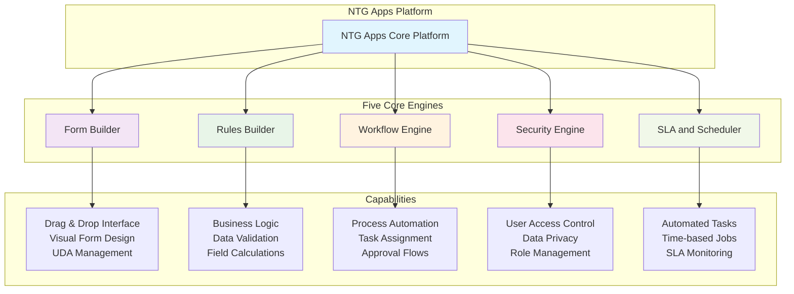

# NTG Apps Reference Guide

> A comprehensive guide to building web applications with NTG Apps rapid development platform

## Table of Contents

1. [Introduction and Platform Overview](#id-1.-introduction-and-platform-overview)
2. [Getting Started](#id-2.-getting-started)
3. [Building Applications](#id-3.-building-applications)
4. [Form Development](#id-4.-form-development)
5. [Data Management](#id-5.-data-management)
6. [Business Logic and Rules](#id-6.-business-logic-and-rules)
7. [Workflow and Process Management](#id-7.-workflow-and-process-management)
8. [Charts and Dashboards](#id-8.-charts-and-dashboards)
9. [Landing Pages and Navigation](#id-9.-landing-pages-and-navigation)
10. [Data Integration](#id-10.-data-integration)
11. [Advanced Features](#id-11.-advanced-features)
12. [System Administration](#id-12.-system-administration)
13. [Troubleshooting and Best Practices](#id-13.-troubleshooting-and-best-practices)

---

## 1. Introduction and Platform Overview

### 1.1 What is NTG Apps?

NTG Apps is an application factory for building web applications with responsive mobile interfaces. It uses rapid app development instead of traditional low-code or no-code approaches.

The platform allows you to build forms with an easy-to-use graphical interface designer. You can create business processes and monitor usage through tasks, notifications, and tracking.

### 1.2 Platform Architecture

#### Deployment Options
- **On-premise**: Install on your own servers
- **Cloud**: Use hosted cloud services

#### Database Support
- **Oracle**: Enterprise database support
- **PostgreSQL**: Open-source database support

You can use either Oracle or PostgreSQL, but you only need one database type per installation.

### 1.3 Core Engines


*Figure 1: NTG Apps five core engines structure*

NTG Apps has five main core engines that work together:

#### Form Builder
- Drag and drop utility for building forms
- Creates business applications and forms
- Easy visual interface design

#### Rules Builder
- Data manipulation and business logic
- Validations and conditions
- Field calculations and operations

#### Workflow Engine
- Process automation regardless of workflow complexity
- Multi-step approval processes
- Task assignment and routing

#### Security Engine
- Design-level security and privacy
- Data-level access control
- User and group-based permissions

#### Schedule and SLA Engine
- Automates non-human tasks
- Time-based operations
- Service level agreement monitoring

### 1.4 User Interface Components

The platform provides:
- **UI Designer**: Visual form and interface design
- **Portal**: End-user access with dashboards
- **Analytics**: Built-in reporting and analytics
- **Mobile Applications**: Responsive mobile interface

---

## 2. Getting Started

### 2.1 Login and Navigation

#### Accessing the System
1. Open the NTG Apps login page
2. Enter your username and password
3. Click login to access the platform

#### Understanding Modes
NTG Apps has two main modes:

**Run Mode (Default)**
- This is the output mode for applications
- End users interact with your applications here
- Shows the final user interface

**Design Mode**
- Click the settings icon to enter design mode
- This is where you design and build applications
- Only developers and administrators use this mode

### 2.2 Basic Navigation

#### Side Menu
- Lists all your applications
- Shows modules within each application
- Provides quick access to forms and features

#### Top Navigation
- User profile and settings
- Notifications and tasks
- Help and assistance tools

---

## 3. Building Applications

### 3.1 What is an Application?

An application in NTG Apps is a project or container. It holds different forms and business cases together. Think of it as starting a new project.

### 3.2 Creating Applications

#### Method 1: Using the Applications Menu
1. Go to the applications section
2. Click the plus sign to create new application
3. Fill in the application details

#### Method 2: Using the Application Wizard
1. Click "New Application Wizard"
2. Follow the step-by-step guide
3. The wizard helps create the basic structure

#### Application Configuration

**Application Name**
- Choose a clear, descriptive name
- Example: "HR System" or "Employee Management"

**Application Identifier**
- Must be 1-3 letters only
- Affects database table naming
- Example: "EMP" for Employee system

**Application Details**
- Short notes and description
- Homepage URL (optional)
- Application icon selection

**Visual Settings**
- Display border and border color
- Background images
- Custom styling options

### 3.3 Module Types

#### Form Module
- Creates database tables
- Most common module type
- Used for business data entry
- Supports add, list, modify, delete operations

#### Dictionary Module
- Simple key-value data storage
- Used for lookup lists and reference data
- Limited functionality compared to form modules
- Only supports add operation by default

#### Free Module
- Does not create database tables
- Used for dashboards and landing pages
- Custom layout and design space
- No data storage, only display

---

## 4. Form Development

### 4.1 Form Builder Basics

#### Creating a Form Module
1. Add new module to your application
2. Select "Form Module" as the module type
3. Enter the module name
4. Save to create the module

**Important**: Adding a new module creates a table in the database automatically. The table name combines your application identifier with the module name.

#### Understanding UDAs (User Defined Attributes)

UDAs are fields or attributes you add to forms. They are organized in categories:

- **Simple Fields**: Basic data entry fields
- **Complex Fields**: Advanced fields with special functions
- **Invokers**: Buttons that execute actions
- **Charts**: Data visualization components

### 4.2 Panel Organization

#### What are Panels?
Panels are containers that hold UDAs. They help organize your form layout and design.

#### Panel Types
- **Card**: Standard container with borders
- **Tab View**: Creates tabbed interface
- **Accordion**: Collapsible sections
- **Field List**: Simple list layout

#### Panel Configuration
- **Main Panel**: Takes full screen width
- **Sub Panel**: Nested inside main panels
- **Split Card**: Divides into two sections
- **Panel Order**: Controls display sequence

### 4.3 Simple UDAs

#### Text Field
**Purpose**: Basic text input
**Configuration**:
- Title and caption
- Font family and styling
- Input mode (normal, read-only, mandatory)
- Span size for width control

**Example**: Employee name, description, comments

#### Auto ID
**Purpose**: Automatic sequence generation
**Configuration**:
- Prefix (letters before number)
- Suffix (letters after number)
- Digits length (number of digits)
- Position and span size

**Example**: Employee ID like "EMP00001"

#### Numeric Field
**Purpose**: Number input and calculations
**Configuration**:
- Default value
- Number format and decimals
- Minimum and maximum values
- Currency settings

**Example**: Salary, quantity, price

#### Date Field
**Purpose**: Date and time input
**Configuration**:
- Date only or date and time
- Default value options
- Date format settings
- Input restrictions

**Example**: Birth date, hire date, deadline

#### Checkbox
**Purpose**: True/false or yes/no values
**Configuration**:
- Default value (checked or unchecked)
- Label text
- Styling options

**Example**: Active status, agreement confirmation

#### Text Memo
**Purpose**: Multi-line text input
**Configuration**:
- Height and width settings
- Character limits
- Text formatting options

**Example**: Comments, descriptions, notes

#### Label
**Purpose**: Display titles and headers
**Configuration**:
- Font size and family
- Text alignment (center, left, right)
- Bold and italic styling
- Color settings

**Example**: Form titles, section headers

#### Help UDA
**Purpose**: Provide user guidance and information
**Configuration**:
- Appear as content or info icon
- Rich text formatting
- Images and links
- Background colors

**Example**: Instructions, explanations, warnings

#### Calculated Field
**Purpose**: Automatic calculations between fields
**Configuration**:
- Select fields for calculation
- Choose operation (add, subtract, multiply, divide)
- Result display format

**Example**: Total price = quantity × unit price

### 4.4 Complex UDAs

#### Value List
**Purpose**: Dropdown selection from predefined options

**Static Value List**:
- Fixed options that don't change
- Suitable for: gender, status, categories
- Managed in value list repository

**Dictionary Value List**:
- Dynamic options from dictionary modules
- Users can add/remove options
- Suitable for: countries, departments, branches

**Configuration**:
- Value list type selection
- Repository or dictionary selection
- Default value setting
- Order and display options

#### Form List
**Purpose**: Select data from other forms
**Features**:
- Display multiple fields together
- Mapping functionality
- Filter capabilities
- Concatenation of values

**Configuration**:
- Source application and module
- Display fields selection
- Mapping definitions
- Filter conditions

**Database Impact**: Creates two columns (ID and value)

#### Radio Button
**Purpose**: Single selection from visible options
**Configuration**:
- Same as value list configuration
- Visual display as radio buttons
- Best for 2-4 options

**Example**: Gender selection, yes/no questions

#### Multi-select Dropdown
**Purpose**: Select multiple options from a list
**Configuration**:
- Link to application and module
- Field selection for display
- Multiple value handling

**Example**: Skills, categories, permissions

#### Grid
**Purpose**: Display multiple related records
**Features**:
- One-to-many relationships
- Multiple columns and headers
- Add, edit, delete operations
- Input mode control

**Configuration**:
- Grid headers definition
- Column types and widths
- Input mode (normal, read-only, add-only)
- Background and styling

**Database Impact**: Creates separate linked table

#### Image
**Purpose**: Upload and display images
**Configuration**:
- Default image selection
- Field height settings
- Image format support
- Display options

**Example**: Employee photos, product images

#### Attachment
**Purpose**: File upload and management
**Configuration**:
- File type restrictions
- Access permissions (personal, group, public)
- Multiple file support

**Example**: Documents, resumes, contracts

#### Note/Comments
**Purpose**: Collaborative commenting system
**Features**:
- Multiple users can add comments
- Timestamp and user tracking
- Threaded discussions

**Database Impact**: Separate table for comments

#### Assignment Info
**Purpose**: Link form records to system users
**Configuration**:
- Company and organization selection
- Group and member assignment
- User profile integration

### 4.5 UDA Configuration Options

#### Input Modes
- **Normal**: Standard input and editing
- **Read Only**: Display only, no editing
- **Mandatory**: Required field, cannot be empty
- **Temporary**: Special temporary mode

#### Conditional Settings
- **Conditional Visible**: Show/hide based on conditions
- **Conditional Read Only**: Enable/disable based on conditions
- **Conditional Mandatory**: Require based on conditions

#### Search Configuration
- **Appear in Search**: Include in search functionality
- **Default Search**: Show in default search list
- **Search Order**: Priority in search results

#### Mobile Settings
- Special configuration for mobile devices
- Responsive design options
- Mobile-specific layouts

---

## 5. Data Management

### 5.1 Value Lists and Dictionaries

#### When to Use Static Value Lists
Use static value lists when:
- Options never change (gender: male/female)
- Fixed business rules
- System-defined values
- No user maintenance needed

#### When to Use Dictionary Value Lists
Use dictionary value lists when:
- Options may change over time
- Users need to add new options
- Business data that grows
- User maintenance required

**Example**: Branches - when company opens new branches, users can add them without developer help.

#### Creating Value List Repository
1. Go to Settings → Repositories → Value List
2. Click "Add New Value List"
3. Enter value list caption/name
4. Add individual values with sequence numbers
5. Save the repository

#### Best Practices
- Use clear, descriptive names
- Include application prefix in names
- Organize by business function
- Document purpose and usage

### 5.2 Form Lists and Mapping

#### Form List Benefits
- Link related data between forms
- Automatic data retrieval
- Mapping capabilities
- Filter functionality

#### Display Value Configuration
1. Select source application and module
2. Choose fields to display
3. Set display order (order of selection = display order)
4. Configure concatenation

#### Mapping Functionality
**Build Mapping**:
- Source: Field from referenced form
- Target: Field in current form
- Automatic data population

**Build Filter**:
- Condition-based filtering
- Dynamic list updates
- User-specific data

### 5.3 Data Privacy and Security

#### Data Privacy Types

**Restricted Security**
- Only creator can see their data
- Each user sees only their own records

**Restricted Security with Supervision**
- Creator and manager can see data
- Hierarchical access control

**Team Security**
- Creator, manager, and team members can see data
- Shared team visibility

**Group Security**
- Creator and group members can see data
- Group-based sharing

#### Implementing Data Privacy
1. Right-click on form name
2. Select "Edit Form"
3. Go to "Data Privacy" tab
4. Check "Restricted Security"
5. Select appropriate security type
6. Add exceptions if needed
7. Save configuration

#### Exceptions
- Add specific groups that should see all data
- Management oversight capabilities
- Administrative access control

---

## 6. Business Logic and Rules

### 6.1 Rules Engine Overview

#### Where to Execute Rules
- **Form Level**: Execute when form actions occur
- **Invoker Level**: Execute when button is clicked
- **Schedule Level**: Execute at specific times
- **UDA Level**: Execute when field values change
- **Workflow Level**: Execute during process steps

#### Execution Types
- **Creation**: When record is created
- **After Creation**: After record is saved
- **Modification**: When record is modified
- **After Modification**: After modification is saved
- **On Form Initialization Before Creation**: When form opens for new record
- **On Form Initialization Before Modification**: When form opens for editing

### 6.2 Mapping Rules

#### Static Mapping Backend
**Purpose**: Map static values or system values
**Common Uses**:
- Current date mapping
- Current user information
- Fixed values
- System-generated data

**Configuration**:
1. Select target field
2. Choose dynamic value or enter static value
3. Set execution type
4. Save rule

**Example**: Automatically set creation date and created by user

#### Form Mapping
**Purpose**: Get data from other forms without SQL
**Configuration**:
1. Select system objects (source form)
2. Choose source fields
3. Set filter conditions
4. Configure target mapping

**Use Cases**:
- Copy data between related forms
- Lookup values from master data
- Update related records

#### Database Repository Mapping
**Purpose**: Execute custom SQL queries for data retrieval
**Configuration**:
1. Create database repository with SQL query
2. Set query parameters and conditions
3. Configure mapping (grid or text/value list)
4. Choose mapping type (push or clear)

**Grid Mapping Types**:
- **Push**: Append to existing data
- **Clear**: Replace all existing data

### 6.3 JavaScript Rules

#### Basic JavaScript Rule Structure
```javascript
// Get values from UDAs
let firstName = UDA.first_name;
let lastName = UDA.last_name;

// Perform operations
let fullName = firstName + " " + lastName;

// Set result to UDA
UDA.full_name = fullName;
```

#### Common JavaScript Examples

**Date Calculations**:
```javascript
let startDate = new Date(UDA.start_date);
let endDate = new Date(UDA.end_date);
let timeDiff = endDate - startDate;
let daysDiff = Math.ceil(timeDiff / (1000 * 60 * 60 * 24));
UDA.requested_days = daysDiff;
```

**String Concatenation**:
```javascript
let result = UDA.field1 + " " + UDA.field2;
UDA.result_field = result;
```

#### Testing JavaScript Rules
1. Write your JavaScript code
2. Use console.log() for testing
3. Click "Test Script" button
4. Enter test values
5. Check console output
6. Debug and refine code

### 6.4 SQL Rules

#### When to Use SQL Rules
- Complex database operations
- Multi-table updates
- Advanced data calculations
- Bulk data processing

#### Basic SQL Rule Structure
```sql
UPDATE table_name 
SET column_name = value 
WHERE condition;
```

#### Example: Update Related Records
```sql
UPDATE emp_employees 
SET defined_leave_days = defined_leave_days - (
    SELECT requested_days 
    FROM lm_leave_management 
    WHERE employee_name = emp_employees.full_name
)
WHERE full_name = 'Employee Name';
```

### 6.5 Advanced Rules

#### Push Data from Current Object to Another
**Purpose**: Insert or update records in other forms
**Configuration**:
- Update type: Clear and push or Append
- Filter conditions
- Field mapping
- Target form selection

#### User Message
**Purpose**: Display messages to users
**Types**:
- Error (prevents saving)
- Warning (allows saving)
- Information (notification only)

#### Call Web Service
**Purpose**: Integrate with external systems
**Configuration**:
- REST or SOAP service configuration
- Headers and parameters
- Request/response mapping

### 6.6 Rule Best Practices

#### Execution Order
- Use parent order to control rule sequence
- Lower numbers execute first
- Plan rule dependencies carefully

#### Condition Building
- Use clear, specific conditions
- Test conditions thoroughly
- Document complex logic

#### Error Handling
- Anticipate error scenarios
- Provide meaningful error messages
- Test edge cases

#### Performance Considerations
- Avoid complex operations in frequently triggered rules
- Use efficient SQL queries
- Minimize JavaScript processing

---

## 7. Workflow and Process Management

### 7.1 Workflow Fundamentals

#### What is a Workflow?
A workflow is a series of connected tasks that automate business processes. In NTG Apps, workflows can handle any number of steps and complexity levels.

#### Workflow Components
- **Tasks**: Individual steps in the process
- **Routes**: Paths between tasks
- **Conditions**: Decision points in the flow
- **Actions**: Operations performed at each step

#### When to Use Workflows
- Approval processes
- Multi-step business operations
- Task assignment and tracking
- Process automation

### 7.2 Creating Workflows - Step by Step

#### Step 1: Process Definition
1. Go to your form module
2. Click "Process Definition"
3. Design your workflow using the visual designer
4. Save the process with a descriptive name

#### Step 2: Plan Template
1. Go to "Plan Template"
2. Click "Add New Template"
3. Enter template name and description
4. Go to template details
5. Add plan to task with process type
6. Select your created process
7. Set task description and urgency
8. Save template

#### Step 3: Plan UDA
1. Go to your form designer
2. Add Plan UDA from complex fields
3. Configure field name and position
4. Check "Copy Plan Template" option
5. Set privilege (who can see the workflow)
6. Save UDA

#### Step 4: Copy Plan Template Rule
1. Go to form rules
2. Add new rule: "Copy Plan Template"
3. Set execution type (usually "Creation")
4. Select plan field (your Plan UDA)
5. Select default plan template
6. Save rule

### 7.3 Task Types

#### Human Task
**Purpose**: Assign work to people
**Configuration**:
- Task name and description
- Assignee selection (users or groups)
- Task duration and priority
- Email notifications
- Field visibility and permissions

**Assignee Options**:
- Originator (person who started process)
- Specific user
- Group of users
- Manager/supervisor

#### Process Task
**Purpose**: Automated system actions
**Configuration**:
- Task name and milestone
- Automatic execution rules
- Data updates and calculations
- No human interaction required

**Common Uses**:
- Update status fields
- Send notifications
- Calculate values
- Trigger other processes

#### Conditional Task
**Purpose**: Decision routing based on conditions
**Configuration**:
- Condition builder
- True/false routing
- Field value evaluation
- Complex logical conditions

#### Question Task
**Purpose**: Simple yes/no decisions
**Configuration**:
- Similar to human task
- Limited to yes/no responses
- Binary routing options

#### Switch Case Task
**Purpose**: Multiple condition routing
**Configuration**:
- Multiple case conditions
- Default case handling
- Complex decision trees

#### Merge Task
**Purpose**: Wait for multiple parallel tasks
**Configuration**:
- Combines multiple workflow paths
- Waits for all paths to complete
- Synchronization point

### 7.4 Task Configuration

#### Human Task Settings

**Basic Information**:
- Task name and sequence
- Duration and priority
- Description with dynamic fields
- Milestone assignment

**Assignment Configuration**:
- Company and organization
- Group or individual assignment
- Manager hierarchy
- Email assignment

**Field Visibility**:
- Select required fields
- Set input modes (normal, read-only, mandatory)
- Hide unnecessary fields
- Inherit from form or override

**Email Notifications**:
- Send email on assign
- Send email on submit
- Actionable emails (external actions)
- Custom email templates

#### Task Expiration
- Set task duration
- Automatic escalation
- Manager notification
- Default actions on expiry

### 7.5 Workflow Routes

#### Route Types
- **Default**: Standard flow path
- **Conditional**: Based on conditions
- **Error**: Error handling path

#### Route Configuration
1. Connect tasks with arrows
2. Set route names (approved, rejected, etc.)
3. Configure conditions if needed
4. Set default routes

#### Multiple Routes
- Tasks can have multiple outgoing routes
- Based on user selection
- Conditional evaluation
- Error handling

### 7.6 Adding Rules to Workflow Tasks

#### After Action Rules
1. Click on task in process designer
2. Go to "After Action" section
3. Click "Build Rules"
4. Add mapping or other rules
5. Configure rule execution

**Common After Action Rules**:
- Update status fields
- Send notifications
- Calculate values
- Update related records

### 7.7 Email Templates

#### Creating Email Templates
1. Go to Email Template section
2. Click "Add New Template"
3. Enter template name
4. Design email content

#### Email Design Features
- Subject line with dynamic fields
- Rich text formatting
- Image insertion
- HTML content support
- Dynamic field insertion

#### Using Email Templates in Workflow
1. Add Email Task to workflow
2. Select created template
3. Configure recipient
4. Set dynamic email if needed

### 7.8 Workflow Monitoring

#### Task Management
- View assigned tasks
- Task priority and due dates
- Task completion tracking
- Performance monitoring

#### Workflow Progress
- Graphical workflow view
- Task status tracking
- Completion timeline
- Bottleneck identification

#### Notifications
- System notifications
- Email notifications
- Task assignments
- Deadline reminders

---

## 8. Charts and Dashboards

### 8.1 Creating Dashboards

#### Setting Up Free Module for Dashboard
1. Add new module to your application
2. Select "Free Module" type
3. Enter module name (e.g., "Main Dashboard")
4. Check "Expose as Dashboard" if you want it on main page
5. Set sequence number for dashboard order
6. Save module

### 8.2 Chart Types

#### Counter Chart
**Purpose**: Display single numeric values
**Configuration**:
- Chart type: Basic or Advanced
- Application and module selection
- Function: Count, Sum, Average
- Condition filters
- Icon and styling

**Example**: Total employees, active users, pending requests

#### Bar Chart
**Purpose**: Compare values across categories
**Configuration**:
- Group by field selection
- Aggregation function
- Condition filtering
- Height and styling options

**Example**: Employees by department, sales by month

#### Donut/Pie Chart
**Purpose**: Show proportional data
**Configuration**:
- Group by categorical field
- Count or sum functions
- Color palette selection
- Label display options

**Example**: Status distribution, category breakdown

#### Grid Chart
**Purpose**: Display tabular data with drill-down
**Configuration**:
- Field selection for columns
- Data filtering and conditions
- Export capabilities
- Drill-down configuration

**Example**: Employee list, transaction details

#### Line Chart
**Purpose**: Show trends over time
**Configuration**: (Advanced only)
- Requires custom SQL query
- Time series data
- Multiple data series support

**Example**: Sales trends, performance metrics

### 8.3 Basic vs Advanced Charts

#### Basic Charts
**Advantages**:
- No coding required
- Simple configuration
- Quick setup
- Built-in drill-down to lists

**Configuration Steps**:
1. Select chart type: Basic
2. Choose application and module
3. Select aggregation function (Count, Sum, etc.)
4. Choose group by field (for grouping charts)
5. Set conditions if needed
6. Configure styling and captions

**Limitations**:
- Limited customization
- Single data source
- Predefined functionality

#### Advanced Charts
**Advantages**:
- Full customization with SQL queries
- Multiple data sources
- Complex calculations
- Custom drill-down behavior

**Configuration Steps**:
1. Select chart type: Advanced
2. Create or select database repository
3. Write SQL query for data
4. Configure mandatory fields
5. Set up grid headers (for grid charts)
6. Configure custom drill-down

**Requirements**:
- SQL knowledge needed
- More complex setup
- Custom maintenance

### 8.4 Chart Configuration Options

#### Styling Options
- Chart height and width
- Color palettes
- Icon selection
- Background colors
- Text formatting

#### Data Options
- Filtering conditions
- Aggregation functions
- Grouping fields
- Sorting options

#### Interactive Options
- Drill-down configuration
- Export capabilities
- Filter controls
- Responsive design

### 8.5 Drill-down Functionality

#### Basic Drill-down
- Automatically goes to filtered list
- Uses same filters as chart
- Standard list operations
- Export and search capabilities

#### Advanced Drill-down - Open Form
**Configuration**:
1. Enable drill-down in chart settings
2. Select "Open Form" option
3. Choose target application and form
4. Set identifier field for linking
5. Save configuration

**Result**: Click on chart data opens related form record

#### Advanced Drill-down - Repository
**Configuration**:
1. Create intermediate drill-down repository
2. Set up linking conditions
3. Configure popup data display
4. Optional: Add form drill-down as second level

**Result**: Multi-level drill-down with custom data views

#### Three-Level Drill-down
1. **Chart Level**: Initial data visualization
2. **Repository Level**: Detailed popup with related data
3. **Form Level**: Individual record details

### 8.6 Database Repositories for Advanced Charts

#### Creating Database Repository
1. Go to Repositories → Database
2. Click "Add New Repository"
3. Select default database
4. Enter operation name
5. Write SQL query
6. Save repository

#### SQL Query Examples

**Simple Select**:
```sql
SELECT * FROM emp_employees
```

**Grouped Data**:
```sql
SELECT department, COUNT(*) as employee_count 
FROM emp_employees 
GROUP BY department
```

**Joined Tables**:
```sql
SELECT e.employee_name, d.department_name, e.basic_salary
FROM emp_employees e
JOIN hr_departments d ON e.department = d.department_name
```

#### Using Repository in Charts
1. Select Advanced chart type
2. Choose your created repository
3. Configure caption fields
4. Set up grid headers if needed
5. Configure drill-down options

### 8.7 Dashboard Layout and Design

#### Panel Organization
- Use panels to organize charts
- Control chart positioning with span sizes
- Create sections with different panel types

#### Responsive Design
- Charts adapt to different screen sizes
- Mobile-friendly layouts
- Tablet and desktop optimization

#### Dashboard Privileges
- Control who can see dashboards
- Group-based access control
- Role-specific dashboards

### 8.8 Exposing Dashboards

#### Portal Integration
1. Edit module settings
2. Check "Expose as Dashboard"
3. Set sequence number
4. Save configuration
5. Dashboard appears on main page

#### Multiple Dashboards
- Create different dashboards for different roles
- Use sequence numbers to control order
- Role-based dashboard access

---

## 9. Landing Pages and Navigation

### 9.1 Creating Landing Pages

#### Free Module Setup
1. Add new module to application
2. Select "Free Module" type
3. Enter descriptive name (e.g., "Landing Page")
4. Configure exposure settings
5. Save module

#### Content Design
**Label UDA for Titles**:
- Add Label UDA for page titles
- Configure font size (e.g., 22pt)
- Set font family and styling
- Choose text alignment

**Help UDA for Content**:
- Add Help UDA for content sections
- Check "Appear as Content" option
- Write descriptive text about your application
- Format with colors and styling

**Panel Organization**:
- Create main panel for content
- Use background colors (white is recommended)
- Organize content in logical sections

### 9.2 Navigation with Shortcuts

#### Shortcut UDA Configuration
1. Add Shortcut UDA to your landing page
2. Set span size (typically 3 for multiple shortcuts)
3. Configure shortcut image and icon
4. Set up navigation target

#### Shortcut Image Setup
1. Click "Shortcut Image" configuration
2. Select icon from available options
3. Choose default or language-specific versions
4. Submit image selection

#### Shortcut Navigation Setup
1. Click "Shortcut Configuration"
2. Choose navigation type:
   - **Internal**: Within NTG Apps system
   - **External**: Outside URL
3. For internal navigation:
   - Select target application
   - Choose module and form
   - Set navigation method (same tab, new tab, popup)

#### Common Shortcut Examples
- **Employee List**: Navigate to employee listing
- **Add New Employee**: Direct access to employee form
- **Leave Requests**: Access leave management
- **Dashboard**: Link to analytics dashboard
- **Payroll System**: Access payroll module

### 9.3 Layout and Positioning

#### Span Control
- Use "Before Span" to add spacing
- Center shortcuts by adding appropriate spacing
- Balance layout across screen width

#### Panel Styling
- Set background colors
- Remove shadows if desired
- Control borders and appearance
- Create visual hierarchy

### 9.4 Menu Customization

#### Side Menu Configuration
1. Go to Customization → Menu Customization
2. View all applications and modules
3. Edit menu item names and titles
4. Set display order
5. Control visibility

#### Custom Menu Names
- Change default names to user-friendly terms
- Use business terminology
- Make navigation intuitive for end users

**Example**: Change "Add" to "Add New Employee"

### 9.5 Exposing Landing Pages

#### Dashboard Exposure
1. Edit module settings
2. Check "Expose as Dashboard"
3. Set sequence number (1 for main landing page)
4. Save configuration

#### Multiple Landing Pages
- Create role-specific landing pages
- Use different sequence numbers
- Control access with privileges

### 9.6 Best Practices for Landing Pages

#### Design Principles
- Keep layout clean and simple
- Use consistent styling
- Provide clear navigation paths
- Include helpful descriptions

#### User Experience
- Make frequently used functions easily accessible
- Group related shortcuts together
- Use meaningful icons and labels
- Test navigation flows

#### Maintenance
- Update shortcuts when adding new features
- Keep content current and relevant
- Monitor user feedback
- Regularly review navigation efficiency

---

## 10. Data Integration

### 10.1 Integration Overview

NTG Apps supports two types of integration:

#### Inbound Integration
- External systems send data TO your NTG Apps
- You expose API endpoints
- Others connect to your system
- You are the recipient of data

#### Outbound Integration  
- Your NTG Apps sends data TO external systems
- You connect to external APIs
- You are the sender of data
- You consume external services

### 10.2 Inbound Integration

#### Creating API Endpoints

**Step 1: Access Interface Document**
1. Go to your form module
2. Click "Interface Document"
3. Select integration type (Add, Update, Get, Upload)
4. Choose or create integration token
5. Generate the endpoint

**Step 2: Integration Types**
- **Add**: Allow external systems to create records
- **Update**: Allow external systems to modify records  
- **Get**: Allow external systems to retrieve records
- **Upload**: Allow external systems to upload files

**Step 3: Integration Token**
Integration tokens provide security and organization:
- Group related integrations
- Provide authentication
- Control access levels
- Track integration usage

#### Generated Documentation
The interface document provides:
- **Endpoint URL**: The API address to call
- **Headers**: Required HTTP headers
- **Request Format**: JSON structure for sending data
- **Response Format**: JSON structure of returned data
- **Error Codes**: Exception handling information

#### Testing with Postman

**Download Collection**:
1. Click "Download as Postman Collection"
2. Save the collection file
3. Import into Postman application

**Test API Calls**:
1. Open imported collection in Postman
2. Fill in request body with test data
3. Include required headers and authentication
4. Send request and verify response
5. Check that data appears in your NTG Apps

**Example Request Body**:
```json
{
  "employee_name": "John Doe",
  "first_name": "John", 
  "last_name": "Doe",
  "branches": "Main Branch",
  "department": "IT"
}
```

### 10.3 Outbound Integration

#### Creating REST Repositories

**Step 1: Set Up Repository**
1. Go to Settings → Repositories → REST Repository
2. Click "Add New Repository"
3. Enter repository name
4. Configure endpoint details

**Step 2: Configure Connection**
- **URL**: External API endpoint
- **Method**: GET, POST, PUT, DELETE
- **Headers**: Content-Type, Authorization, etc.
- **Parameters**: Query parameters if needed
- **Body**: Request body for POST/PUT operations

**Step 3: Test Connection**
1. Click "Test" to verify connection
2. Check response format
3. Verify authentication
4. Save repository

#### Using REST Repository in Forms

**Add Call REST Web Service Rule**:
1. Go to form rules or add to invoker
2. Add new rule: "Call REST Web Service"
3. Select your REST repository operation
4. Configure input and output mapping

**Input Mapping**:
- Map form fields to API request parameters
- Set static values if needed
- Configure dynamic data

**Output Mapping**:
- Map API response to form fields
- Handle arrays and objects
- Set target UDAs for response data

#### Example Implementation
```javascript
// API Response handling
{
  "fact": "Cats sleep 70% of their lives",
  "length": 28
}

// Mapping to form fields
response.fact → UDA.integration_response
response.length → UDA.fact_length
```

### 10.4 Integration Security

#### Authentication Methods
- **API Keys**: Include in headers or parameters
- **Bearer Tokens**: OAuth and JWT tokens
- **Basic Authentication**: Username/password
- **Custom Headers**: Application-specific authentication

#### Best Practices
- Store credentials securely
- Use HTTPS for all communications
- Implement proper error handling
- Log integration activities
- Monitor API usage limits

### 10.5 Error Handling

#### Common Integration Issues
- **Authentication failures**: Check tokens and credentials
- **Network timeouts**: Verify connectivity and endpoints
- **Data format errors**: Validate JSON structure
- **Rate limiting**: Implement retry logic

#### Error Response Handling
- Parse error messages from external APIs
- Provide meaningful user feedback
- Log errors for troubleshooting
- Implement fallback procedures

---

## 11. Advanced Features

### 11.1 Schedule Jobs

#### Purpose of Schedule Jobs
Schedule jobs automate non-human tasks that run at specific intervals without user interaction. Use them for:
- Regular data updates
- Automated notifications
- Cleanup operations
- Batch processing
- Report generation

#### Creating Schedule Jobs

**Step 1: Access Schedule Job**
1. Go to your form module
2. Click "Schedule Job" tab
3. Click "Add New Job"

**Step 2: Configure Schedule**
- **Job Name**: Descriptive name for the job
- **Time Unit**: Minute, Hour, Day, Week, Month
- **Frequency Options**:
  - Every [time unit]
  - Every specific [time]
  - Between specific times
  - On specific days

**Step 3: Choose Action Type**
- **Rule Invoker**: Execute any rule or set of rules
- **Send Email**: Send automated email notifications

**Step 4: Set Recurrence**
- **Once**: Execute only one time
- **Recurring**: Repeat based on schedule
- **Interval**: Frequency within time unit

**Step 5: Add Conditions**
- Optional conditions for job execution
- Skip execution if conditions not met
- Dynamic condition evaluation

#### Schedule Job vs Workflow

**Schedule Job**:
- Time-based execution
- No human interaction required
- Runs automatically at intervals
- System-initiated

**Workflow**:
- Event-based execution
- Can include human tasks
- Triggered by user actions
- Form submission initiated

### 11.2 Bulk Operations

#### Bulk Data Import/Export

**Download Template**:
1. Go to form list view
2. Click "Bulk" option
3. Select "Download Template"
4. Excel template downloads with form structure

**Prepare Data**:
- Fill Excel template with your data
- Ensure mandatory fields are completed
- Use correct format for dates and numbers
- Match lookup values exactly

**Upload Data**:
1. Click "Bulk" → "Create"
2. Attach your completed Excel file
3. Review field mappings
4. Verify data preview
5. Execute bulk import

#### Bulk Operations Types
- **Create**: Insert new records
- **Update**: Modify existing records
- **Merge**: Combine create and update

#### Data Validation
- Mandatory field checking
- Data type validation
- Lookup value verification
- Duplicate detection

### 11.3 Advanced Search and Filtering

#### Search Configuration
**Field-Level Search**:
1. Edit UDA configuration
2. Check "Appear in Search"
3. Set search order priority
4. Enable "Default Search Appear"

**Advanced Search Interface**:
- Multiple criteria filtering
- AND/OR logical operations
- Date range filtering
- Numeric range filtering
- Text contains/equals operations

#### Search Templates
**Save Search Criteria**:
1. Configure search filters
2. Click "Save" on search interface
3. Enter template name
4. Reuse saved searches

**Share Search Templates**:
- Export search configurations
- Import to other systems
- Team collaboration on searches

### 11.4 Mobile Configuration

#### Mobile-Specific Settings
- Responsive design options
- Mobile dashboard exposure
- Touch-friendly interfaces
- Optimized layouts

#### Mobile Dashboard
1. Edit module settings
2. Check "Expose as Dashboard in Mobile"
3. Configure mobile-specific layouts
4. Test on mobile devices

---

## 12. System Administration

### 12.1 User and Group Management

#### Creating System Users

**User Creation Process**:
1. Go to Security → Users
2. Click "Add New User" (if you have privileges)
3. Select authentication type (Database, LDAP, Email, API)
4. Fill user details:
   - First name and last name
   - Username (unique identifier)
   - Email address
   - Profile information
5. Save user

**Automatic Email**:
- User receives email with login credentials
- Initial password provided
- Account activation instructions

#### Group Hierarchy

**Three-Level Structure**:
1. **Company**: Top-level organization
2. **Organization**: Department or division
3. **Group**: Team or role-based groups

**Creating Groups**:
1. Go to Security → Groups
2. Click "Add New Group"
3. Enter group details:
   - Group name and description
   - Group type (Company, Organization, or Group)
   - Parent company/organization
   - Status (Active, Suspended, Terminated)
4. Set common email for group notifications
5. Save group

#### User Assignment
**Adding Users to Groups**:
1. Go to user profile
2. Click "Groups" section
3. Add user to appropriate groups
4. Set group membership status
5. Save assignment

### 12.2 Privilege Management

#### Form-Level Privileges
**Available Privileges**:
- **Add**: Create new records
- **List/View**: See record lists
- **Modify**: Edit existing records
- **Delete**: Remove records
- **Bulk**: Import/export operations
- **Log View**: See activity logs

**Granting Privileges**:
1. Go to form designer
2. Click "Privilege" tab
3. Select organization/group
4. Check desired privileges
5. Save privilege settings

#### Field-Level Privileges
**Granular Control**:
1. Edit UDA configuration
2. Uncheck "Grant by Default"
3. Select specific groups
4. Set access level (Normal, Read Only)
5. Save field privileges

### 12.3 Application Management

#### Import/Export Applications
**Export Application**:
1. Go to application designer
2. Click three dots menu
3. Select "Export"
4. Download application package

**Import Application**:
1. Go to applications list
2. Click import option
3. Upload application package
4. Configure import settings
5. Complete import process

#### Application Cloning
**Clone Application**:
1. Select source application
2. Click "Clone" option
3. Enter new application details
4. Choose components to clone
5. Complete cloning process

### 12.4 System Customization

#### Theme and Styling
**Company Logo**:
1. Go to Customization → Company Logo
2. Upload new logo image
3. Set logo dimensions
4. Save changes

**Color Schemes**:
- Predefined color palettes
- Custom color configuration
- Theme consistency across application

#### Language and Localization
**Multi-Language Support**:
1. Configure system language settings
2. Add translations for each UDA
3. Set language-specific content
4. Test in different languages

**Translation Process**:
1. Edit UDA configuration
2. Click language icon
3. Enter translations for each language
4. Save translations

#### System Text Customization
**Menu Customization**:
1. Go to Customization → Menu Customization
2. Edit menu item names
3. Set display order
4. Control visibility
5. Save changes

---

## 13. Troubleshooting and Best Practices

### 13.1 Common Issues and Solutions

#### Privilege and Access Problems

**Issue**: Cannot see form or application
**Solution**:
1. Check user group membership
2. Verify form privileges for user's groups
3. Confirm application access rights
4. Review data privacy settings

**Issue**: Cannot see records in list
**Solution**:
1. Check list privilege specifically
2. Review data privacy configuration
3. Verify user created the records (if restricted security)
4. Check for data filters

#### Workflow Execution Issues

**Issue**: Workflow not starting
**Solution**:
1. Verify Plan UDA is configured correctly
2. Check Copy Plan Template rule execution type
3. Confirm plan template exists and is linked
4. Review rule conditions

**Issue**: Tasks not appearing
**Solution**:
1. Check task assignment configuration
2. Verify user is in assigned group
3. Review task visibility settings
4. Check for task expiration

#### Chart and Dashboard Problems

**Issue**: Chart shows no data
**Solution**:
1. Verify data exists in source tables
2. Check chart filters and conditions
3. Review database repository query (for advanced charts)
4. Confirm user has access to source data

**Issue**: Drill-down not working
**Solution**:
1. Check drill-down configuration
2. Verify identifier field mapping
3. Review target form privileges
4. Test with different data

### 13.2 Performance Optimization

#### Query Optimization
**Database Repository Performance**:
- Use specific WHERE clauses
- Limit result sets with TOP or LIMIT
- Create indexes on frequently queried fields
- Avoid complex JOINs when possible

**Chart Performance**:
- Use basic charts for simple requirements
- Optimize SQL queries for advanced charts
- Implement appropriate filters
- Cache frequently accessed data

#### Large Dataset Handling
**Bulk Operations**:
- Process data in smaller batches
- Validate data before bulk import
- Use appropriate bulk operation type
- Monitor system resources during processing

### 13.3 Development Best Practices

#### Naming Conventions
**Applications**:
- Use descriptive, business-friendly names
- Include version numbers if needed
- Use consistent abbreviations

**UDAs and Fields**:
- Use clear, descriptive names
- Follow consistent naming patterns
- Avoid special characters
- Use business terminology

**Rules and Processes**:
- Name rules based on their function
- Include execution context in name
- Document complex logic
- Use sequential numbering for order

#### Application Structure
**Module Organization**:
- Group related functionality together
- Separate transaction data from master data
- Use consistent module types
- Plan for future expansion

**Security Design**:
- Implement least privilege principle
- Use group-based security
- Plan data privacy early
- Document security requirements

#### Testing Approaches
**Development Testing**:
- Test each UDA configuration
- Verify all validation rules
- Test workflow paths thoroughly
- Validate integration endpoints

**User Acceptance Testing**:
- Test with actual business data
- Verify business process flows
- Test error scenarios
- Validate performance with realistic loads

### 13.4 Documentation Standards

#### Application Documentation
- Document business requirements
- Explain data relationships
- Detail workflow processes
- Include user guides

#### Technical Documentation
- Document custom rules and JavaScript
- Explain integration configurations
- Detail security settings
- Maintain change logs

#### User Training Materials
- Create step-by-step guides
- Include screenshots and examples
- Explain business context
- Provide troubleshooting tips

---

## Appendices

### Appendix A: UDA Quick Reference

#### Simple UDAs
| UDA Type | Purpose | Key Configuration |
|----------|---------|-------------------|
| Text Field | Basic text input | Input mode, validation |
| Auto ID | Automatic sequence | Prefix, suffix, digits |
| Numeric Field | Number input | Default value, format |
| Date Field | Date/time input | Date type, default value |
| Checkbox | Boolean values | Default checked state |
| Text Memo | Multi-line text | Height, character limits |
| Label | Titles and headers | Font size, alignment |
| Calculated Field | Automatic calculations | Source fields, operation |

#### Complex UDAs
| UDA Type | Purpose | Key Configuration |
|----------|---------|-------------------|
| Value List | Dropdown selection | Static vs dictionary |
| Form List | Link to other forms | Source form, mapping |
| Radio Button | Visible option selection | Value list source |
| Multi-select | Multiple option selection | Source application |
| Grid | One-to-many relationships | Headers, input mode |
| Image | Image upload/display | Height, default image |
| Attachment | File management | Access permissions |
| Note | Collaborative comments | Automatic timestamps |
| Plan | Workflow integration | Copy plan template |

### Appendix B: Rule Types Reference

#### Mapping Rules
- **Static Mapping Backend**: Fixed values and system data
- **Form Mapping**: Data from other forms
- **Database Repository Mapping**: Custom SQL queries

#### Action Rules
- **JavaScript Rule**: Custom scripting
- **SQL Rule**: Database operations
- **Call REST Web Service**: External API calls
- **Push Data**: Insert/update other forms
- **User Message**: User notifications
- **Copy Plan Template**: Workflow initiation

### Appendix C: Workflow Task Types

| Task Type | Purpose | Human Interaction |
|-----------|---------|-------------------|
| Human Task | User assignments | Yes |
| Process Task | Automated actions | No |
| Conditional Task | Decision routing | No |
| Question Task | Yes/no decisions | Yes |
| Switch Case Task | Multiple conditions | No |
| Merge Task | Parallel synchronization | No |
| Dummy Task | Design organization | No |

### Appendix D: Integration Endpoints

#### Inbound Integration Types
- **Add**: Create new records
- **Update**: Modify existing records
- **Get**: Retrieve records
- **Upload**: File uploads

#### Outbound Integration
- **REST Repository**: Connect to external APIs
- **Call REST Web Service Rule**: Execute API calls
- **Input/Output Mapping**: Data transformation

### Appendix E: Common Error Messages

#### Authentication Errors
- **Invalid session token**: Check integration token configuration
- **Access denied**: Verify user privileges
- **Authentication failed**: Check credentials

#### Data Errors
- **Mandatory field missing**: Complete required fields
- **Invalid data format**: Check data types and formats
- **Duplicate record**: Check unique constraints

#### System Errors
- **Server error**: Check system logs and connectivity
- **Timeout**: Verify network connection and server response
- **Database connection failed**: Check database configuration

---

## Glossary

**Application**: A container or project that holds related forms and business processes.

**UDA (User Defined Attribute)**: Fields or components you add to forms. The basic building blocks of forms.

**Module**: A component within an application. Can be Form, Dictionary, or Free module types.

**Form Module**: Creates database tables and provides full CRUD operations.

**Dictionary Module**: Simple key-value storage for lookup data.

**Free Module**: No database table creation; used for dashboards and landing pages.

**Panel**: Container that organizes UDAs within forms.

**Span Size**: Width control for UDAs, based on 12-column grid system.

**Value List**: Dropdown selection field with predefined options.

**Form List**: Dropdown that gets data from other forms with mapping capabilities.

**Grid**: One-to-many relationship display with multiple records.

**Rule**: Business logic that executes automatically based on triggers.

**Execution Type**: When rules execute (creation, modification, initialization, etc.).

**Workflow**: Automated business process with connected tasks and routing.

**Human Task**: Workflow step requiring user interaction.

**Process Task**: Automated workflow step with no user interaction.

**Plan UDA**: Field that links workflows to forms.

**Integration Token**: Security mechanism for API access and organization.

**Inbound Integration**: External systems sending data to NTG Apps.

**Outbound Integration**: NTG Apps sending data to external systems.

**Schedule Job**: Automated tasks that run at specific time intervals.

**Data Privacy**: Security settings controlling who can see which records.

**Drill-down**: Navigation from charts to detailed data views.

**Repository**: Reusable data source configuration for charts and integrations.

---

*This completes the NTG Apps Reference Guide. For additional support, use the built-in NTG Apps Assistant or contact your system administrator.*
